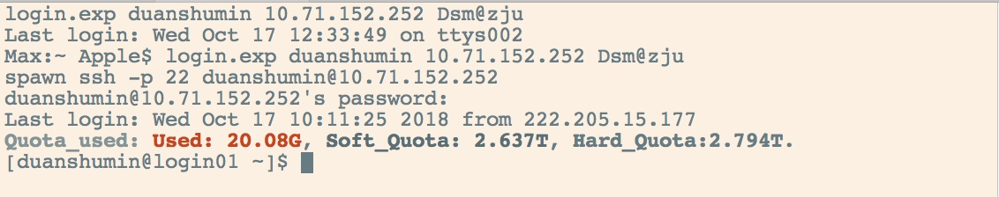
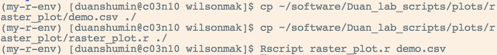
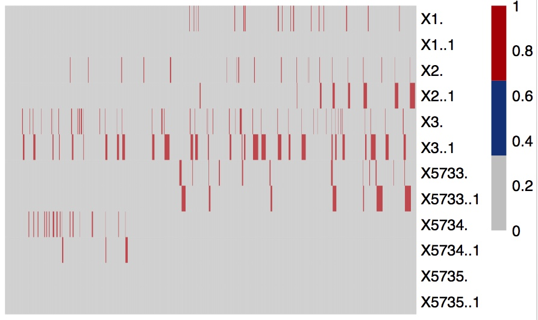
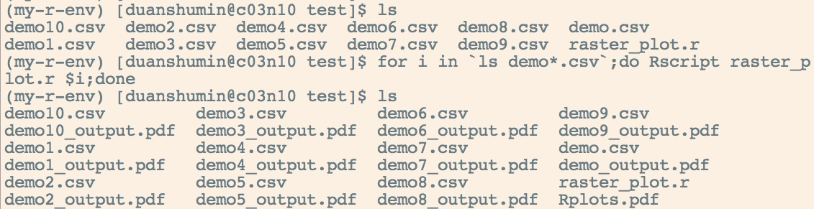
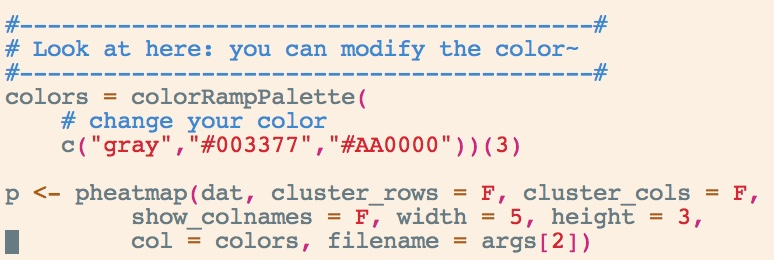

## running the raster_plot.r in HPC
1. sign in (see details in 电镜中心集群资料 in FTP)

2. ssh into a computing node
`ssh c03n10`

3. activate the R environment
`source activate my-r-env`

4. enter your personal folder and run the R script (your data need to be upload by _filezilla_ software first)
* cd **the_path_of_your_folder**
* cp **the_path_of_original_script**
* Rscript **the_path_of_your_raster_plot_script** **your_original_data** 

5. the pdf will be generated
* e.g demo_output.pdf

here is the result

6. if you want to name your pdf first, you can use the following command
* Rscript **the_path_of_your_raster_plot_script** **your_original_data** **the_name_you_want.pdf**

## batch processing for your data
if you have lots of csv file need to be processed, you can use a _for_ loop to generate pdf files. 

## modify the color of your plot

you can change the defult color setting by modifying the script (you have to copy the script into your own folder first)
* `vi raster_plot.r`
* press _i_
* cahnge color
* press _esc_
* press _:wq_

